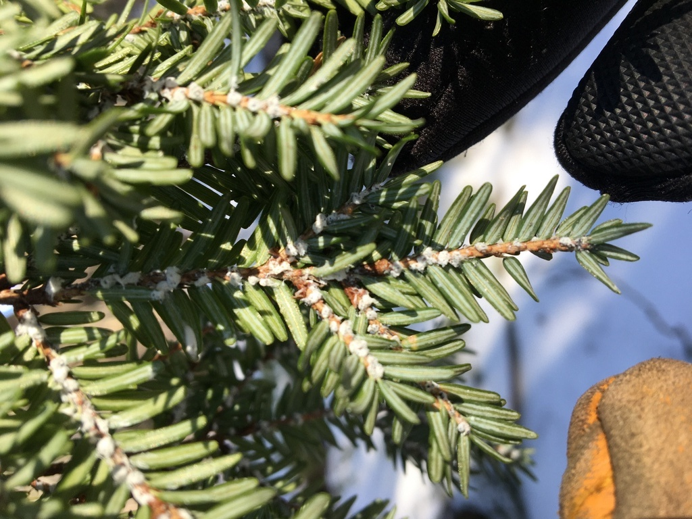
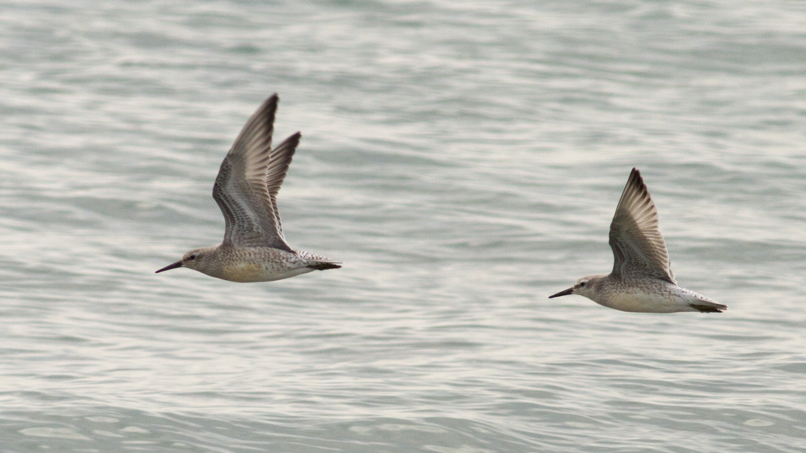
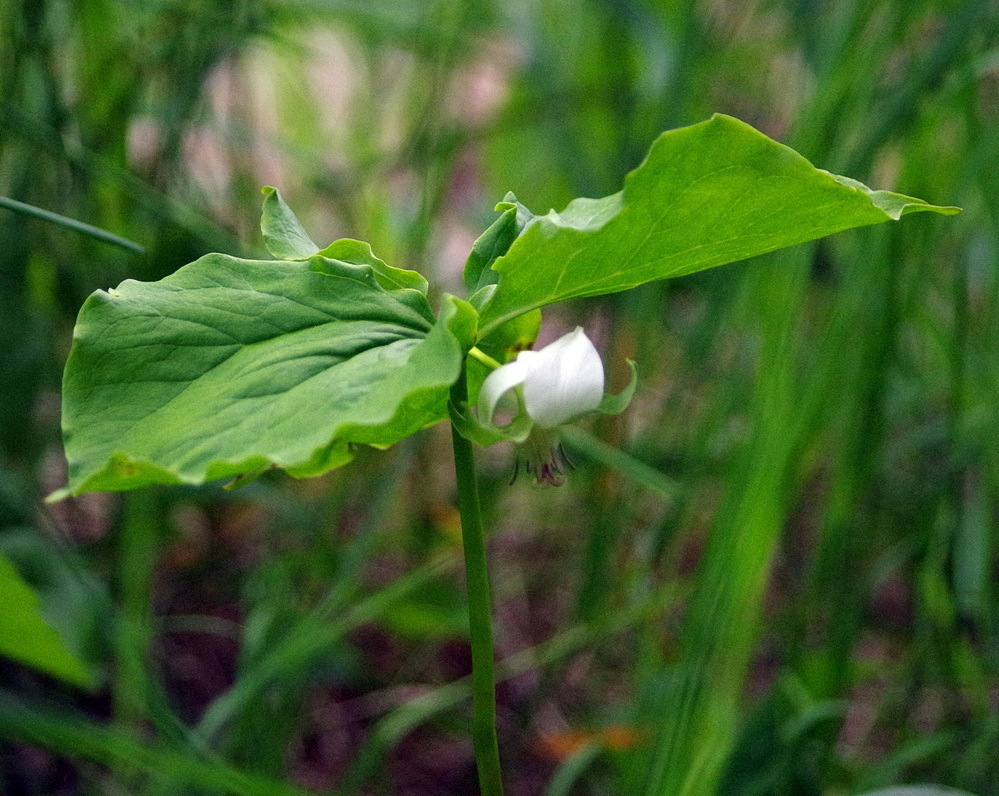
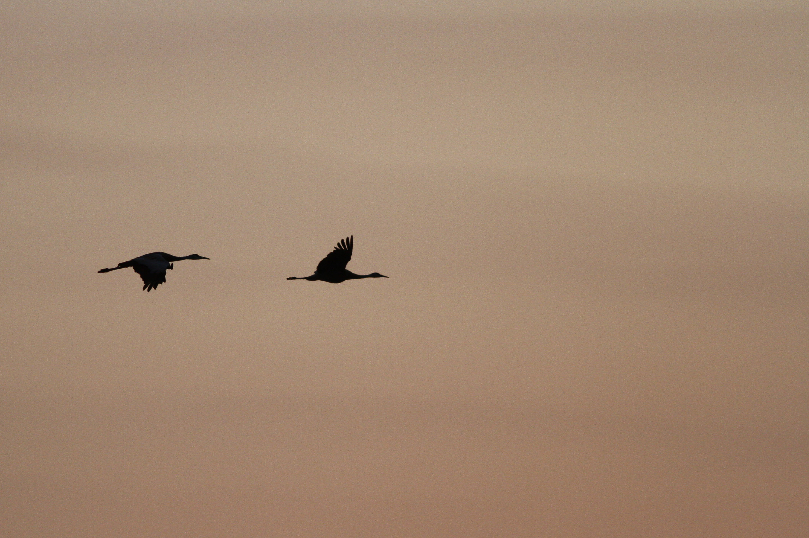
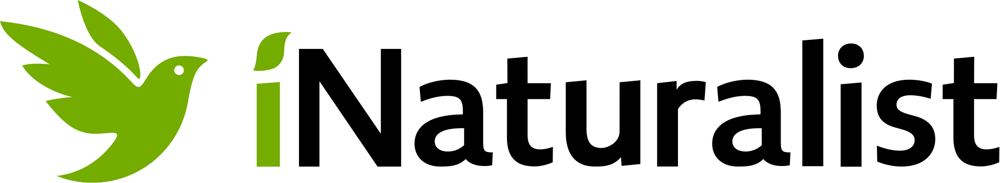
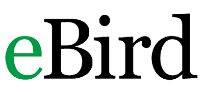
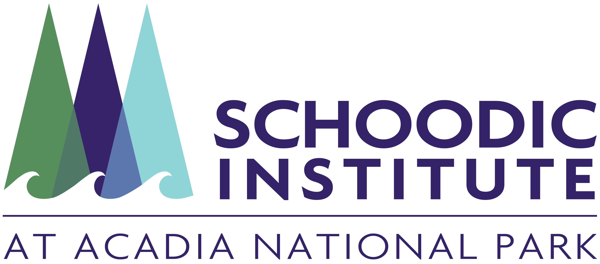

```{r echo = FALSE, include = FALSE}
library(tidyverse)
library(lubridate)
library(kableExtra)
library(htmltools)
library(sf)
library(gt)
library(downloadthis)
source("email_alerts/email_functions.R")

start <- format(today() - 7, "%d %B %Y")
end <- format(today()-1, "%d %B %Y")

# ## Pull iNaturalist and eBird data
# inat <- inat_recent("1647", "week", "Acadia National Park")
# ebird <- ebird_recent("US-ME-009", "Acadia National Park")
# 
# 
# ## Run the three function and combine rows for iNaturalist
# inat_twf <- bind_rows(inat %>% watchlist_inv(), inat %>% watchlist_te(),
#                          inat %>% watchlist_rn()) %>% 
#   mutate(observed.on = as.character(observed.on))
# 
# ## Run the three function and combine rows for eBird
# ebd_twf <- bind_rows(ebird %>% watchlist_inv(), ebird %>% watchlist_te(),
#                       ebird %>% watchlist_rn())
# 
# 
# ## Add to the full database and export
# if(nrow(inat_twf) > 0) {
# read.csv("email_alerts/www/datasets/inat_fulldata.csv") %>% 
#   bind_rows(inat_twf) %>% 
#   select(-c(datetime:count)) %>% 
#   write.csv(., "email_alerts/www/datasets/inat_fulldata.csv", row.names = F)
# }
# 
# if(nrow(ebd_twf) > 0) {
# read.csv("email_alerts/www/datasets/ebd_fulldata.csv") %>% 
#   bind_rows(ebd_twf) %>% 
#   select(-c(speciesCode:license)) %>% 
#   write.csv(., "email_alerts/www/datasets/ebd_fulldata.csv", row.names = F)
# }
# 
# 
# ## Make a df with 'groups' to add to the data
# groups <- data.frame(iconic.taxon.name = c("Plantae", "Mammalia", "Animalia", "Aves", "Insecta",
#                                  "Reptilia", "Amphibia", "Fungi", "Protozoa", "Chromista",
#                                  "Arachnida", "Mullusca"),
#            groups = c("Plants", "Mammals", "Other animals", "Birds", "Insects", "Reptiles",
#                       "Amphibians", "Fungi and lichens", "Protozoans", "Kelp and seaweeds",
#                       "Spiders", "Mullusks"))
# 
# ## Combine the two data frames
# final_data <- combine_citsci_data(
#   inat %>% 
#     select(scientific.name, common.name, iconic.taxon.name, observed.on, 
#            place.guess, latitude, longitude, positional.accuracy, user.login, 
#            user.id, captive.cultivated, url, image.url, license), 
#   ebird %>% 
#     select(scientific.name, common.name, iconic.taxon.name, count, observed.on, 
#            place.guess, latitude, longitude, checklist, url), 
#   join = groups)
# 
# 
# ## Run the summary function on the final data
# watchlist_species(final_data, "email_alerts/outputs")
# new_npspecies(final_data, "email_alerts/outputs")


## Read in the outputs from the watchlist + new npspecies functions and format for tables
pests <- read.csv("email_alerts/outputs/invasive_pestslist.csv") %>% 
  select(scientific.name, common.name, observed.on, url) %>% 
  mutate(link = glue::glue("[view observation]({url})"),
         link = map(link, gt::md)) %>%
  select(-url) %>% 
  arrange(common.name, observed.on)


rare <- read.csv("email_alerts/outputs/rare_specieslist.csv") %>% 
  select(scientific.name, common.name, observed.on, url) %>% 
  mutate(link = glue::glue("[view observation]({url})"),
         link = map(link, gt::md)) %>%
  select(-url) %>% 
  arrange(common.name, observed.on)


te <- read.csv("email_alerts/outputs/te_specieslist.csv") %>% 
  select(scientific.name, common.name, listing.status, observed.on, url) %>% 
  mutate(link = glue::glue("[view observation]({url})"),
         link = map(link, gt::md)) %>%
  select(-url) %>% 
  arrange(common.name, observed.on)


newsp <- read.csv("email_alerts/outputs/new_species.csv") %>% 
  select(scientific.name, common.name, observed.on, url) %>% 
  mutate(link = glue::glue("[view observation]({url})"),
         link = map(link, gt::md)) %>%
  select(-url) %>% 
  arrange(common.name, observed.on)


## Clean dataframes and combine to map all obs
mappest <- read.csv("email_alerts/outputs/invasive_pestslist.csv") %>% 
  select(scientific.name, common.name, latitude, longitude, url) 

maprare <- read.csv("email_alerts/outputs/rare_specieslist.csv") %>% 
  select(scientific.name, common.name, latitude, longitude, url) 

mapte <- read.csv("email_alerts/outputs/te_specieslist.csv") %>% 
  select(scientific.name, common.name, latitude, longitude, url) 

mapnew <- read.csv("email_alerts/outputs/new_species.csv") %>% 
  select(scientific.name, common.name, latitude, longitude, url) 


mapcomb <- rbind(mappest, maprare, mapte, mapnew)
  

```


<!-- Top Button -->
<a href = "#"></a>


<!-- Header -->
<div class = "title-box">
  <div class = "title-text-box">
  
  <div class = "h1 header-text">
  Acadia National Park Managers' Report
  </div>
  <div class = "h2 header-text">
  A citizen science early-detection summary
  </div>
  
  <div class = "headerp">
  Welcome to the weekly early detection report of observations submitted by iNaturalist and eBird users. These are all observations submitted over the past week for species that Acadia National Park managers and partners have identified as being of conservation interest. These data for this report comes from two of the largest open source citizen science projects: iNaturalist and eBird. The records included in this report include both casual and research grade observations, so erroneous identifications are possible. Users should double check the identification of species to ensure they are correct.
  </div>
  
  <div class = "header-date"> 
  `r start` - `r end`
  </div>
  
  </div>
</div>


<!-- Body -->
<div class = "custbody">

<!-- Observations Map -->
<div class = "map-box">
  <div class = "body-title-box">
  <h3 class = "boxtitles"> Explore Species Locations </h3>
  </div>
  <div>
  `r leaflet_summary(mapcomb)`
  </div>
</div>


<!-- Pests & Invasives -->
<div class = "pests-box">
  <div class = "body-title-box">
  <h3 class = "boxtitles"> Invasive Species </h3>
  </div>
  
  <h5 class = "cite"> © Jesse Wheeler </h5>
  <div class = "pests-table shrink-table">
```{r pests-table, results = 'asis', echo = FALSE}
if (nrow(pests) > 0) {
  pests %>%
    kbl(col.names = c("Scientific Name", "Common Name", "Date Observed", "Link")) %>%
    kable_styling(bootstrap_options = "hover")
} else {
  cat("<h3>There were no invasive species reported this week.</h3>")
}
```
  <!-- `r ifelse(length(pests$scientific.name) > 0, kbl(pests) %>% kable_styling(bootstrap_options = "hover"), paste0("<h3> There were no pest species reported this week. </h3>"))` -->
  </div>
</div>


<!-- Threatened and Endangered -->
<div class = "te-box">
  <div class = "body-title-box">
  <h3 class = "boxtitles"> Threatened & Endangered Species </h3>
  </div>
  
  <h5 class = "cite"> © Fyn Kynd </h5>
  <div class = "te-table shrink-table">
```{r te-table, results = 'asis', echo = FALSE}
if (nrow(te) > 0) {
  te %>%
    kbl(col.names = c("Scientific Name", "Common Name", "Listing", "Date Observed", "Link")) %>%
    kable_styling(bootstrap_options = "hover")
} else {
  cat("<h3>There were no threatened or endangered species reported this week.</h3>")
}
```
  </div>
</div>


<!-- Rare species -->
<div class = "rare-box">
  <div class = "body-title-box">
  <h3 class = "boxtitles"> Rare Species </h3>
  </div>
  
  <h5 class = "cite" style = "color:white;"> © Andy Fyon </h5>
  <div class = "rare-table shrink-table">
```{r rare-table, results = 'asis', echo = FALSE}
if (nrow(rare) > 0) {
  rare %>%
    kbl(col.names = c("Scientific Name", "Common Name", "Date Observed", "Link")) %>%
    kable_styling(bootstrap_options = "hover")
} else {
  cat("<h3>There were no rare species reported this week.</h3>")
}
```
  </div>
</div>


<!-- New Park Species -->
<div class = "new-box">
  <div class = "body-title-box">
  <h3 class = "boxtitles"> New Park Species </h3>
  </div>
  
  <h5 class = "cite"> © Kyle Lima </h5>
  <div class = "rare-table shrink-table">
```{r newsp-table, results = 'asis', echo = FALSE}
if (nrow(newsp) > 0) {
  newsp %>%
    kbl(col.names = c("Scientific Name", "Common Name", "Date Observed", "Link")) %>%
    kable_styling(bootstrap_options = "hover")
} else {
  cat("<h3>There were no new species to the park reported this week.</h3>")
}
```
  </div>
</div>


<!-- Download -->
<div class = "downloader-box">
  <div class = "body-title-box">
  <h3 class = "boxtitles"> Download Full Datasets </h3>
  </div>
  <div class = "dlb">
  <a href = "https://www.inaturalist.org/"></a>
``` {r echo = FALSE, class.output = "inatbut"}
read.csv("email_alerts/www/datasets/inat_fulldata.csv") %>%
  download_this(
    output_name = "iNaturalist_watchlist_database",
    output_extension = ".xlsx",
    button_label = "Download iNaturalist data",
    button_type = "success",
    has_icon = TRUE,
    icon = "fa fa-save")
```
  </div>
  <div class = "dlb">
  <a href = "https://ebird.org/"></a>
``` {r echo = FALSE, class.output = "ebdbut"}
read.csv("email_alerts/www/datasets/ebd_fulldata.csv") %>%
  download_this(
    output_name = "eBird_watchlist_database",
    output_extension = ".xlsx",
    button_label = "Download eBird data",
    button_type = "success",
    has_icon = F,
    icon = "fa fa-save")
```
  </div>
</div>

</div>


<!-- Footer -->
<div class = "footer-box">
<div class = "footer-content">
<div class = "footer-si">
  
  <p><i>Our Mission is inspiring science, learning, and community for a changing world.</i></p>
</div>
<div>
  <h2>ABOUT</h2>
  <p><a href = "https://github.com/Kylelima21/ANP_managers_report" target="_blank">Source code</a></p>
</div>
<div>
  <h2>DATA ACCESS</h2>
  <p><a href = "https://www.inaturalist.org" target="_blank">iNaturalist</a></p>
  <p><a href = "http://www.ebird.org" target="_blank">eBird</a></p>
  <p><a href = "https://www.gbif.org/" target="_blank">GBIF</a></p>
  <p><a href = "https://www.idigbio.org/" target="_blank">iDigBio</a></p>
</div>
<div>
  <h2>CONTACT</h2>
  <p>Contact us at klima@schoodicinstitute.org</p>
  <p><a href = "https://schoodicinstitute.org/" target = "_blank">Visit our website</a></p>
</div>
</div>
<div class = "copyright">
  <p>&copy; `r format(Sys.Date(), "%Y")` Schoodic Institute</p>
</div>

