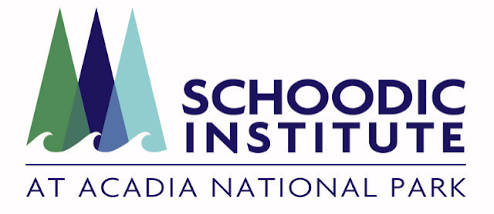

```{r echo = FALSE, include = FALSE}
library(tidyverse)
library(lubridate)
library(kableExtra)
library(htmltools)
library(sf)
library(gt)
source("email_alerts/email_functions.R")

start <- format(today() - 7, "%d %B %Y")
end <- format(today()-1, "%d %B %Y")

## Pull iNaturalist and eBird data
inat <- inat_recent("1647", "week", "Acadia National Park")
ebird <- ebird_recent("US-ME-009", "Acadia National Park")

## Make a df with 'groups' to add to the data
groups <- data.frame(iconic.taxon.name = c("Plantae", "Mammalia", "Animalia", "Aves", "Insecta",
                                 "Reptilia", "Amphibia", "Fungi", "Protozoa", "Chromista",
                                 "Arachnida", "Mullusca"),
           groups = c("Plants", "Mammals", "Other animals", "Birds", "Insects", "Reptiles",
                      "Amphibians", "Fungi and lichens", "Protozoans", "Kelp and seaweeds",
                      "Spiders", "Mullusks"))

## Combine the two data frames
final_data <- combine_citsci_data(inat, ebird, join = groups)


## Run the summary function on the final data
watchlist_species(final_data, "email_alerts/outputs")
new_npspecies(final_data, "email_alerts/outputs")


## Read in the outputs from the watchlist + new npspecies functions and format for tables
pests <- read.csv("email_alerts/outputs/invasive_pestslist.csv") %>% 
  select(scientific.name, common.name, observed.on, url) %>% 
  mutate(link = glue::glue("[view observation]({url})"),
         link = map(link, gt::md)) %>%
  select(-url) %>% 
  arrange(common.name, observed.on)


rare <- read.csv("email_alerts/outputs/rare_specieslist.csv") %>% 
  select(scientific.name, common.name, observed.on, url) %>% 
  mutate(link = glue::glue("[view observation]({url})"),
         link = map(link, gt::md)) %>%
  select(-url) %>% 
  arrange(common.name, observed.on)


te <- read.csv("email_alerts/outputs/te_specieslist.csv") %>% 
  select(scientific.name, common.name, listing.status, observed.on, url) %>% 
  mutate(link = glue::glue("[view observation]({url})"),
         link = map(link, gt::md)) %>%
  select(-url) %>% 
  arrange(common.name, observed.on)


newsp <- read.csv("email_alerts/outputs/new_species.csv") %>% 
  select(scientific.name, common.name, observed.on, url) %>% 
  mutate(link = glue::glue("[view observation]({url})"),
         link = map(link, gt::md)) %>%
  select(-url) %>% 
  arrange(common.name, observed.on)


## Clean dataframes and combine to map all obs
mappest <- read.csv("email_alerts/outputs/invasive_pestslist.csv") %>% 
  select(scientific.name, common.name, latitude, longitude, url) 

maprare <- read.csv("email_alerts/outputs/rare_specieslist.csv") %>% 
  select(scientific.name, common.name, latitude, longitude, url) 

mapte <- read.csv("email_alerts/outputs/te_specieslist.csv") %>% 
  select(scientific.name, common.name, latitude, longitude, url) 

mapnew <- read.csv("email_alerts/outputs/new_species.csv") %>% 
  select(scientific.name, common.name, latitude, longitude, url) 


mapcomb <- rbind(mappest, maprare, mapte, mapnew)
  

```


<!-- Header -->
<div class = "title-box">
  <div class = "titlemain">
  Acadia National Park Manager's Report
  </div>
  <div class = "titlemain2">
  From citizen science observations
  </div>
  <div class = "subtitle"> 
  `r start` - `r end`
  </div>
</div>


<!-- Introduction -->
<div class = "intro-box">
  <div class = "body-title-box">
  <i class = "body-box-icon"></i>
  <h4 class = "body-titles"> Introduction </h4>
  </div>
  <div class = "intro-img-box">
  <a href = "https://www.inaturalist.org/"></a>
  <a href = "https://ebird.org/"></a>
  </div>
  <div class = "intro-text">
  Welcome to the weekly report of iNaturalist and eBird records. These are all observations submitted during the last week for species that Acadia National Park managers have identified as being of management interest. 
  
  These data for this report comes from two of the largest open source citizen science projects: iNaturalist and eBird. The records here are both casual and research grade observations, so erroneous identifications are possible.
  </div>
</div>


<!-- Observations Map -->
<div class = "map-box">
  <div>
  `r leaflet_summary(mapcomb)`
  </div>
</div>


<!-- Pests & Invasives -->
<div class = "pests-box">
  <div class = "body-title-box">
  <h4 class = "body-titles"> Pest & Invasive Species </h4>
  </div>
  
  <h5 class = "cite"> © Jesse Wheeler </h5>
  <div class = "pests-table shrink-table">
  `r ifelse(length(pests$scientific.name) > 0, kbl(pests) %>% kable_styling(bootstrap_options = "hover"), paste0("<h3> There were no pest species reported this week. </h3>"))`
  </div>
</div>


<!-- Threatened and Endangered -->
<div class = "te-box">
  <div class = "body-title-box">
  <h4 class = "body-titles"> Threatened & Endangered Species </h4>
  </div>
  
  <h5 class = "cite"> © Fyn Kynd </h5>
  <div class = "te-table shrink-table">
  `r ifelse(length(te$scientific.name) > 0, kbl(te) %>% kable_styling(bootstrap_options = "hover"), paste0("<h3> There were no threatened or endangered species reported this week. </h3>"))`
  </div>
</div>


<!-- Rare species -->
<div class = "rare-box">
  <div class = "body-title-box">
  <h4 class = "body-titles"> Rare Species </h4>
  </div>
  
  <h5 class = "cite" style = "color:white;"> © Andy Fyon </h5>
  <div class = "rare-table shrink-table">
  `r ifelse(length(rare$scientific.name) > 0, kbl(rare) %>% kable_styling(bootstrap_options = "hover"), paste0("<h3> There were no rare species reported this week. </h3>"))`
  </div>
</div>


<!-- New Park Species -->
<div class = "new-box">
  <div class = "body-title-box">
  <h4 class = "body-titles"> New Park Species </h4>
  </div>
  
  <h5 class = "cite"> © Kyle Lima </h5>
  <div class = "rare-table shrink-table">
  `r ifelse(length(newsp$scientific.name) > 0, kbl(newsp) %>% kable_styling(bootstrap_options = "hover"), paste0("<h3> There were no new species to the park reported this week. </h3>"))`
  </div>
</div>


<!-- Credits -->
<div class = "credits-box">
  <div>
  <a href = "https://schoodicinstitute.org/"></a>
  
  Our mission is inspiring science, learning, and community for a changing world.
  
  This project was made possible in part by a grant from the National Park Foundation.
  
  Background art of Acadia National Park © Ben Tero.
  
  © `r year(today())` Schoodic Institute at Acadia National Park
  </div>
  <div> 
  Data Citations: <br>
  iNaturalist. Available from <a href = "https://www.inaturalist.org/" target =                         "_blank"> https://www.inaturalist.org. </a> `r paste0("Accessed [", today(), "].")`
  
  eBird. eBird: An online database of bird distribution and abundance [web application].
  eBird, Cornell Lab of Ornithology, Ithaca, New York. Available:
  <a href = "https://www.ebird.org" target = "_blank"> http://www.ebird.org. </a> `r paste("(Accessed:   Date [", today(), "]).")`
  
  GBIF.org (14 February 2023) GBIF Occurrence Download https://doi.org/10.15468/dl.pqwpft
  
  GBIF.org (14 February 2023) GBIF Occurrence Download https://doi.org/10.15468/dl.hhz84h
  
  Michonneau F, Collins M, Chamberlain SA (`r year(today())`). ridigbio: An interface to iDigBio's      search API that allows downloading specimen records. R package https://github.com/iDigBio/ridigbio
  
  SCAN. 2023. http//:scan-bugs.org/portal/index.php. Accessed on February 14.
  </div>
</div>
